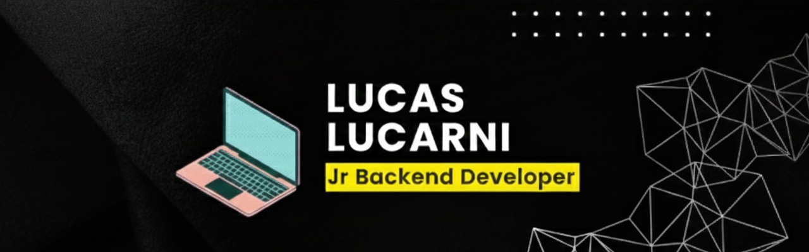

## 👋 Hi, I'm Lucas Lucarni

- 🧠 I'm a Computer Science student at the National University of Quilmes.
- 👀 Interested in Backend Development, AI & Machine Learning
- 🚀 Always learning and improving through academic and personal projects

---

## 🧰 Technologies & Tools

### 💻 Programming Languages

### ⚙️ Backend & Frameworks

### 🗄 Databases

### 📨 Messaging & Streaming

### 🛠 Build & Dev Tools

### 🧠 AI & Machine Learning

### 🧑‍💻 IDEs & Editors

---

## 📫 Contact

- 💼 LinkedIn: https://www.linkedin.com/in/l-lucarni
- 📧 Email: lucaslucarni@yahoo.com.ar

---

⭐ Feel free to explore my repositories and projects!
